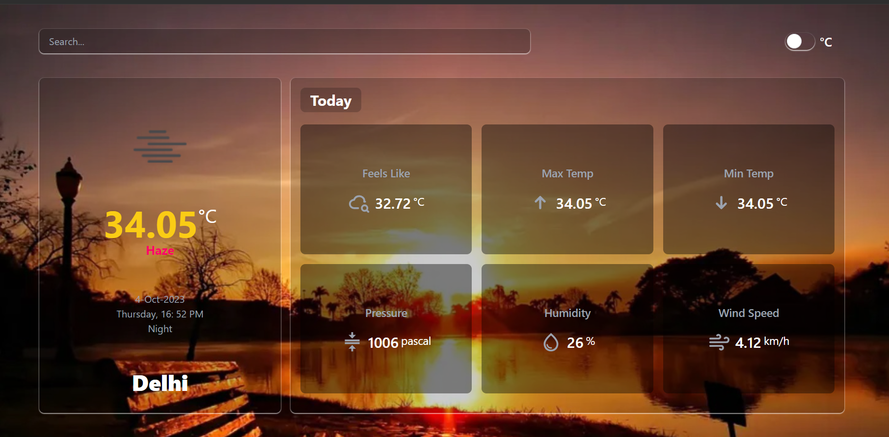

# React Weather DashbOard



Weather App built with React.
[Live Demo](https://whether-dash-board.vercel.app)

## Tech Stack

**React, JavaScript, Tailwind, Redux, React-Icons**

## Features

- **Weather forecast for any city or place**
- **Find user location weather by utilizing GeolocationAPI**
- **One-click Celcius to Fahrenheit conversion and vice versa**

## Getting Started

First you need an API key from OpenWeatherMap, you can get one by creating an account on their website.
After you got your API key, create a **.env.local** file at root directory of project, copy the line below to the file and replace YOUR_KEY with your OpenWeatherMap API Key.

```
VITE_WEATHER_API_KEY=YOUR_KEY
```

Finally clone this repository, install dependencies and run the local server

```bash
git clone https://github.com/se-ashishgupta/Whether_DashBoard.git
```

```bash
cd Whether_DashBoard
npm install
npm run dev
```

## Credits

[OpenWeatherMap](https://openweathermap.org/ 'OpenWeatherMap') (Weather data API)